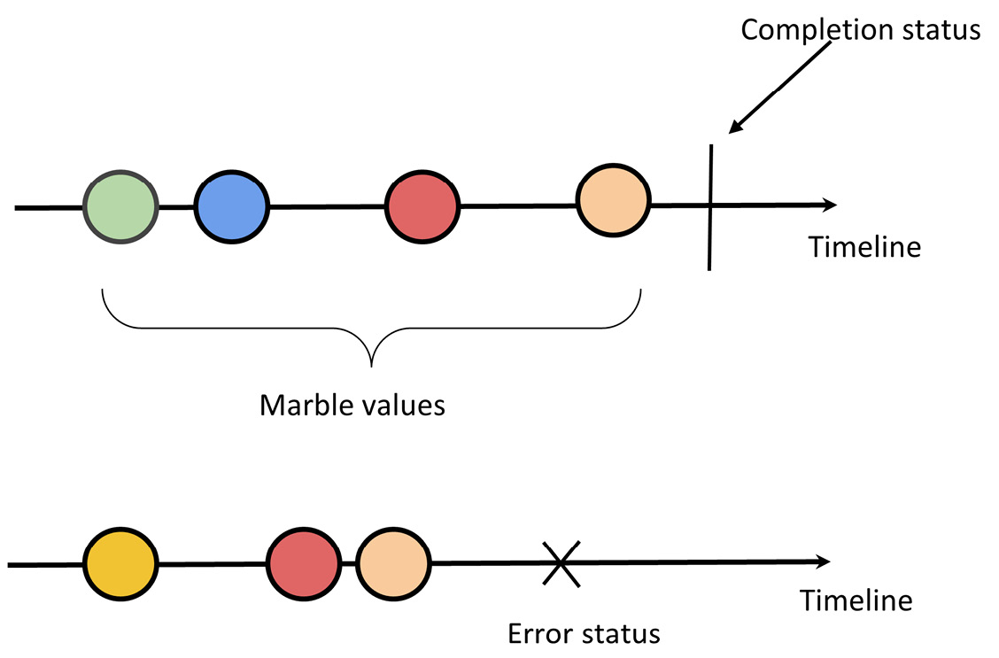
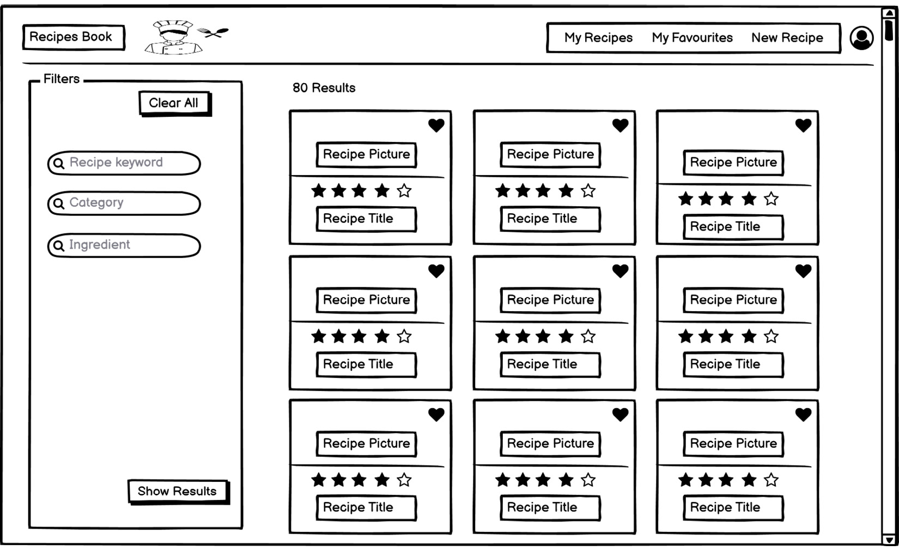
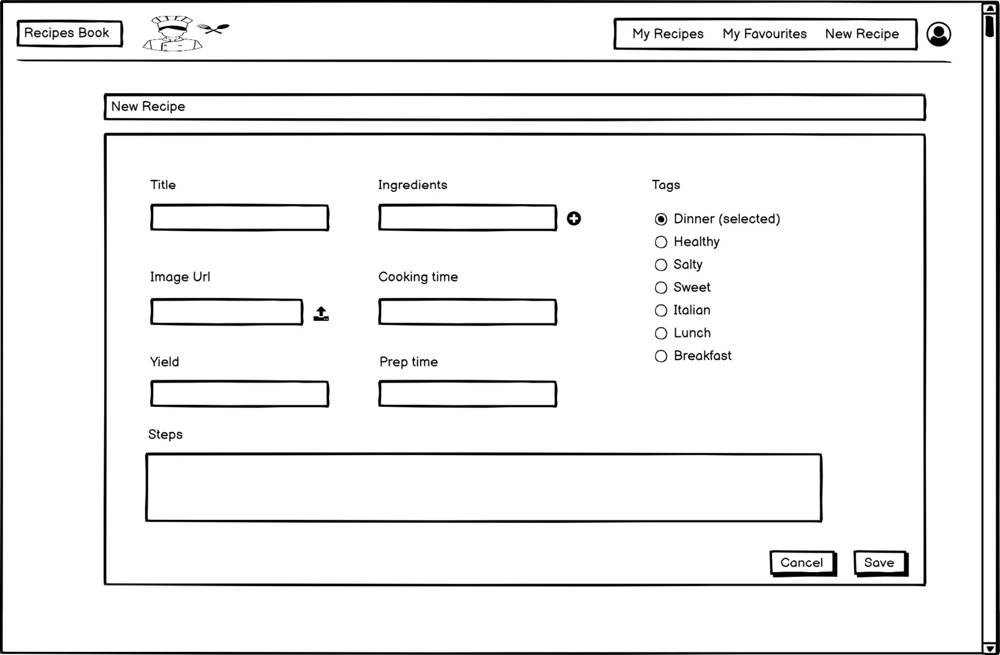
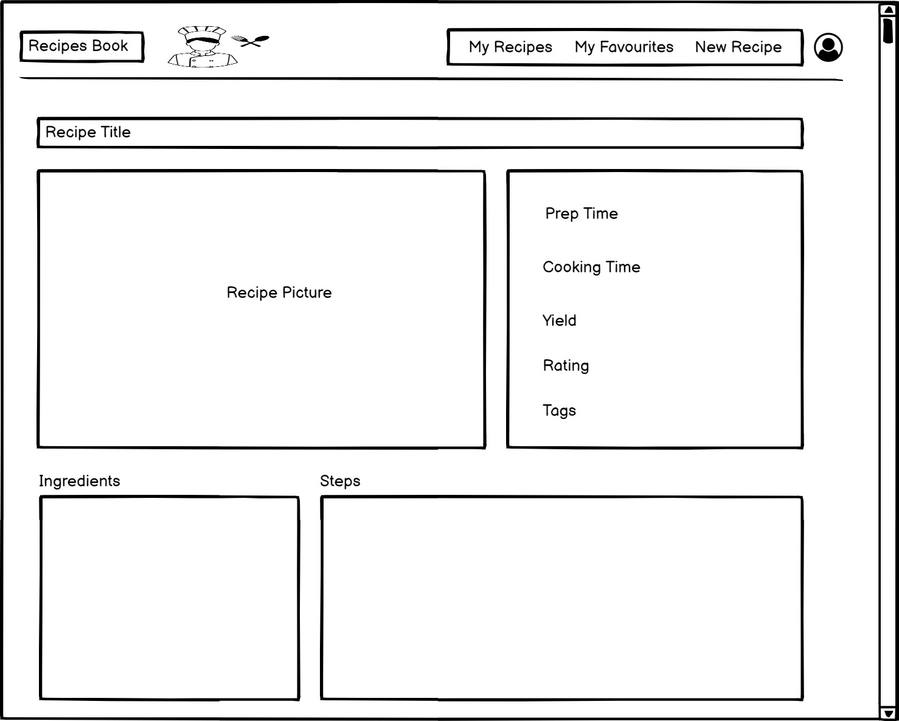

# RxJS experiments

## Intro

Reactive programming is programming with asynchronous data streams and is based on observer patterns.
Everything that may change or happen over time (you don't know when exactly) is represented as asynchronous 
streams such as events, notifications, and messages.  
The **observer pattern** is based on two main roles – a publisher and a subscriber:

* a **publisher** maintains a list of subscribers and notifies them or propagates a change every time there is an
update. **Observables** are a representation of the asynchronous data streams that notify the observers of any change
* a **subscriber** performs an update or executes a side effect every time they receive a notification from the 
publisher. **Observers** are consumers of the data streams emitted by Observables.

The main advantages of RxJS over other asynchronous APIs are as follows:

* Observables guarantee consistency. They emit multiple values over time so that you can consume continuous
data streams.
* Observables are lazy; they are not executed until you subscribe to them.
* Observables can be canceled, completed, and retrieved at any moment. Not doable with Promises
* RxJS provides many operators with a functional style to manipulate collections and optimize side effects.
* Observables push errors to the subscribers and provide a clean way to handle errors.

Marble diagrams are visual representations of the operator's execution. The marble values are the values emitted by
the Observables over time.



## The application

There's a fake Node.js server in the `recipe-book-api` folder. The file `proxy.config.json` is needed by Webpack for
the [proxing support](https://angular.dev/tools/cli/serve#proxying-to-a-backend-server). Just do `npm start` to start 
the server. The proxy support has been put inside `angular.json` file.

### List of available recipes


### New recipe


### Recipe details


## Resources

* [Reactive Patterns with RxJS and Angular Signals - Second Edition](https://learning.oreilly.com/library/view/reactive-patterns-with/9781835087701/)
* [GitHub repo](https://github.com/PacktPublishing/Reactive-Patterns-with-RxJS-and-Angular-Signals-Second-Edition)

## Unsubscription management

The `takeUntil()` operator emits values from the source Observable (the first timeline) until the Observable notifier,
which is given as input (the second timeline), emits a value. At that time, `takeUntil()` will stop the emission and 
complete.  
`takeUntilDestroyed()` completes the observable when the component/directive is destroyed or when the corresponding injector
is destroyed.

```typescript
/* If we have to use the `takeUntilDestroyed` operator outside the injection context, we (the developers) are 
   responsible for providing `DestroyRef` */
#destroyRef = inject(DestroyRef);

// Declarative unsubscription management outside the injection context
this.service.getRecipes()
    .pipe(takeUntilDestroyed(this.#destroyRef))
    .subscribe(result => {
        this.recipes = result;
    });
```
### Resources

* https://angular.love/get-to-know-the-destroyref
* https://angular.dev/guide/di/dependency-injection-context


-> https://learning.oreilly.com/library/view/reactive-patterns-with/9781835087701/B21180_03.xhtml#_idParaDest-57
